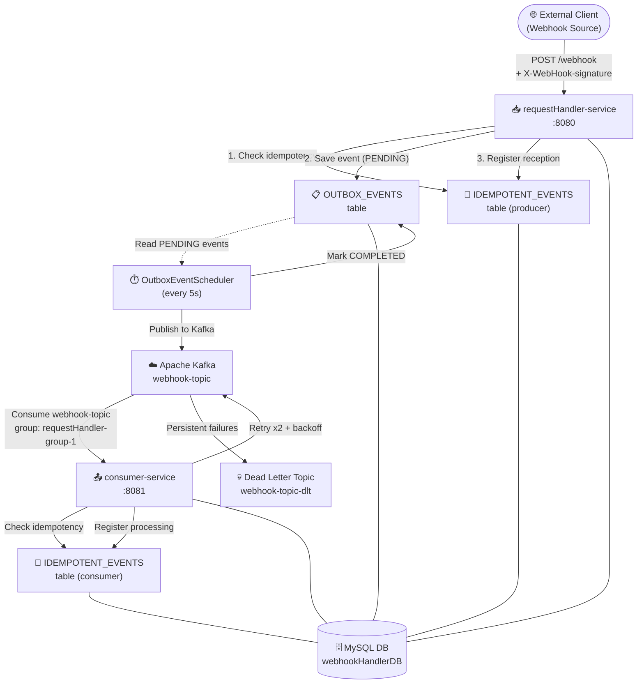
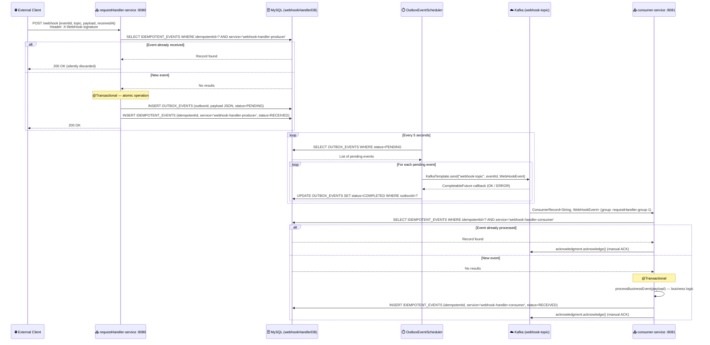
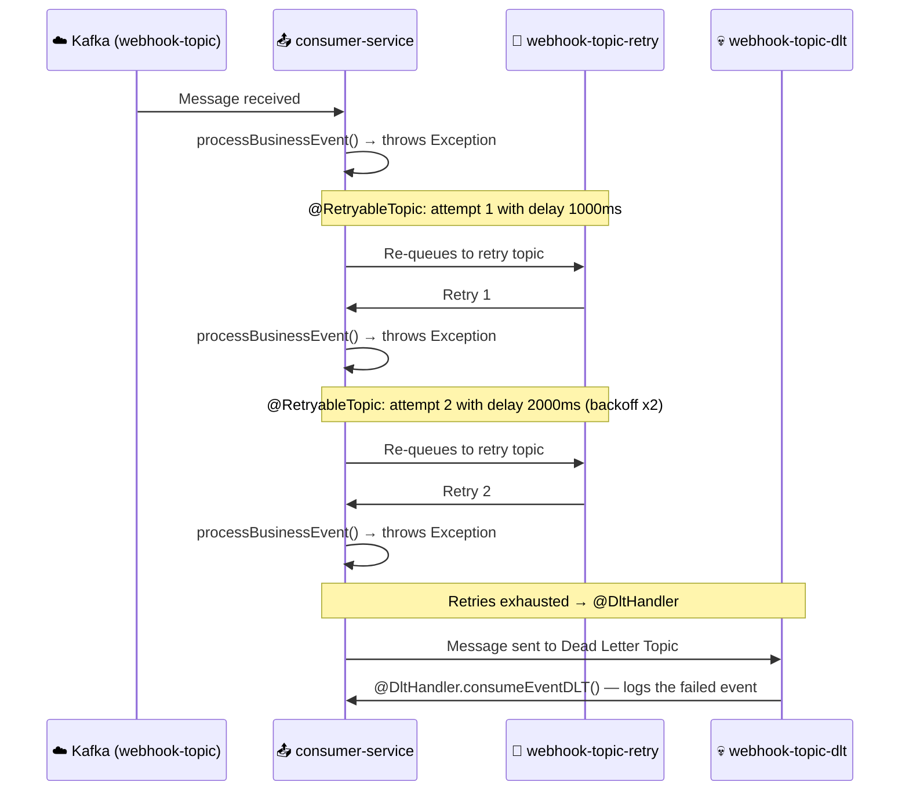

# 📦 Webhook Handler Service

> A reliable webhook reception, processing, and delivery system using the Outbox pattern, idempotency, and asynchronous messaging with Apache Kafka.

## 📋 Table of Contents
- [Overview](#️-overview)
- [Architecture](#️-architecture)
- [Modules & Microservices](#-modules--microservices)
- [Design Patterns](#-design-patterns)
- [Tech Stack](#️-tech-stack)
- [Data Flow](#-data-flow)
- [API Reference](#-api-reference)
- [Getting Started](#-getting-started)
- [Configuration](#️-configuration)
- [Deployment](#-deployment)
- [Contributing](#-contributing)

---

## 🏗️ Overview

**Webhook Handler Service** is a microservices system built with **Spring Boot 4** and **Java 25**, designed to securely receive external webhook events and reliably deliver them to internal consumers.

The system addresses the main reliability challenges in webhook reception:

- **Message loss**: via the **Outbox pattern**, events are persisted to the database before being published to Kafka, ensuring no event is lost even if the broker is temporarily unavailable.
- **Duplicate processing**: via the **Idempotency pattern**, both the producer and consumer track already-processed events, preventing duplicates throughout the entire pipeline.
- **Delivery failures**: via **Retry with exponential backoff** and a **Dead Letter Topic (DLT)**, messages that cannot be processed are automatically retried and, if the failure persists, routed to the DLT for analysis.

---

## 🏛️ Architecture

### Architecture Diagram



### Architecture Style

The project follows an **event-driven microservices** architecture with the following characteristics:

- **Maven multi-module**: a parent POM (`webhookHandler-parent`) manages three modules: `common-service`, `requestHandler-service`, and `consumer-service`.
- **Shared Library**: `common-service` acts as a shared library (non-executable), providing JPA idempotency entities, Kafka event models, broker configuration, and serialization utilities.
- **Event-Driven**: inter-service communication is entirely **asynchronous** via Apache Kafka.
- **Shared Database**: both executable services share the same MySQL instance (_Shared Database_ pattern), each managing their own logical tables.

### Communication Patterns

| From | To | Type | Protocol / Broker | Purpose |
|------|----|------|-------------------|---------|
| External Client | `requestHandler-service` | Synchronous | REST HTTP POST | Webhook reception |
| `OutboxEventScheduler` | Apache Kafka | Asynchronous | Kafka `webhook-topic` | Publish pending events |
| Apache Kafka | `consumer-service` | Asynchronous | Kafka `webhook-topic` | Consume and process event |
| Apache Kafka | `consumer-service` (DLT) | Asynchronous | Kafka `webhook-topic-dlt` | Handle failed messages |

---

## 🧩 Modules & Microservices

### 1. `common-service` — Shared Library

- **Responsibility**: Library module (non-executable JAR). Contains all reusable components for the other services: domain models, JPA entities, Kafka configuration, serialization, and idempotency pattern logic.
- **Port**: N/A (not an executable application; `spring-boot-maven-plugin` has `<skip>true</skip>`).
- **Packaged as a dependency**: both executable services declare it as a Maven dependency.

**Package structure:**

```
common/
├── idempotency/
│   ├── mapper/       → IdempotencyMapper       (MapStruct)
│   ├── respository/  → IdempotencyEntity        (JPA @Entity → IDEMPOTENT_EVENTS)
│   │                 → IdempotencyJpaRepository (Spring Data JPA)
│   └── service/      → IdempotencyHelperImpl    (business logic)
│                     → IdempotencyEnum           (RECEIVED)
│                     → IdempotencyModel          (domain model)
├── kafka/
│   ├── config/       → KafkaAdminConfig         (KafkaAdmin bean)
│   │                 → KafkaDataConfig           (@ConfigurationProperties "kafka-config")
│   │                 → SerializerConfig          (ObjectMapper bean)
│   ├── model/        → BaseEvent                (Kafka base class, implements Serializable)
│   └── serializer/   → SerializerHelperImpl     (JSON serialize/deserialize via Jackson)
└── model/
    ├── WebHookEvent  (extends BaseEvent — Kafka event)
    └── WebHookModel  (domain model for incoming webhook)
```

**JPA Entities:**

| Entity | DB Table | Key Columns |
|--------|----------|-------------|
| `IdempotencyEntity` | `IDEMPOTENT_EVENTS` | `id` (SEQ), `idempotent_id`, `service`, `status` (ENUM) |

**Key dependencies:**

| Dependency | Version | Usage |
|------------|---------|-------|
| `spring-boot-starter-data-jpa` | 4.0.1 | ORM / data access |
| `jackson-databind` / `jackson-core` | BOM | JSON serialization |
| `mapstruct` | 1.6.3 | Object mapping DTO↔Model↔Entity |
| `lombok` | 1.18.42 | Boilerplate reduction |

---

### 2. `requestHandler-service` — Webhook Receiver Service

- **Responsibility**: HTTP entry point for incoming webhooks. Validates event idempotency, persists the event in the Outbox table, and registers its reception. An independent scheduler reads pending Outbox events and publishes them to Kafka.
- **Port**: `8080`
- **Database**: MySQL — `webhookHandlerDB`
- **Required environment variables**: `MYSQL_URL`, `MYSQL_USER`, `MYSQL_PASSWORD`, `KAFKA_CONFIG_BOOTSTRAP_SERVERS`

**Package structure:**

```
requestHandler/
├── controller/
│   ├── dto/          → WebHookReqDto            (eventId, topic, payload, receivedAt)
│   └── WebHookController                        (@RestController /webhook)
├── idempotency/
│   └── controller/   → IdempotencyController    (@RestController /idempotent)
├── kafka/
│   ├── config/       → KafkaProducerConfig      (ProducerFactory + KafkaTemplate beans)
│   │                 → KafkaProducerDataConfig  (@ConfigurationProperties "kafka-producer-config")
│   └── service/      → KafkaMessagePublisher    (interface)
│                     → KafkaMessagePublisherImpl (publishes with CompletableFuture + @PreDestroy)
├── mapper/           → WebHookRestControllerMapper (MapStruct DTO→Model)
├── outbox/
│   ├── controller/   → OutboxEventController    (@RestController /outbox)
│   ├── mapper/       → OutboxEventMapper        (MapStruct Entity→Model)
│   ├── repository/   → OutboxEntity             (JPA @Entity → OUTBOX_EVENTS)
│   │                 → OutboxJpaRepository      (Spring Data JPA)
│   └── service/      → OutboxEventHelperImpl    (CRUD + getPendingOutboxEvents)
│                     → OutboxEventEnum          (PENDING, COMPLETED)
│                     → OutboxModel              (domain model)
├── service/          → WebHookService           (interface)
│                     → WebHookServiceImpl       (orchestrates idempotency + outbox, @Transactional)
└── OutboxEventScheduler                         (@Scheduled every 5s — publishes to Kafka)
```

**REST Endpoints:**

| Method | Endpoint | Required Header | Description |
|--------|----------|----------------|-------------|
| `POST` | `/webhook` | `X-WebHook-signature` | Receives an incoming webhook event |
| `GET` | `/outbox` | — | Lists all records in the Outbox table (debug) |
| `GET` | `/idempotent` | — | Lists all idempotency records (debug) |

**JPA Entities:**

| Entity | DB Table | Key Columns |
|--------|----------|-------------|
| `OutboxEntity` | `OUTBOX_EVENTS` | `id` (SEQ), `outbox_id` (unique), `payload` (JSON), `status` (ENUM) |
| `IdempotencyEntity` | `IDEMPOTENT_EVENTS` | inherited from `common-service` |

**Kafka Producer Configuration:**

| Property | Value |
|----------|-------|
| `key-serializer` | `StringSerializer` |
| `value-serializer` | `JsonSerializer` |
| `idempotency` | `true` (exactly-once semantics) |
| `acks-config` | `all` |
| `retries` | `Integer.MAX_VALUE` |
| `max-in-flight-req-per-connection` | `5` |

**Key dependencies:**

| Dependency | Usage |
|------------|-------|
| `spring-boot-starter-webmvc` | REST API |
| `spring-boot-starter-data-jpa` | ORM |
| `mysql-connector-j` | MySQL driver |
| `spring-cloud-starter-circuitbreaker-resilience4j` | Circuit Breaker (declared, ready to use) |
| `common-service` | Project shared library |

---

### 3. `consumer-service` — Event Consumer Service

- **Responsibility**: Consumes messages from the Kafka topic `webhook-topic`, applies idempotency to prevent duplicate processing, executes the business logic for the event, and performs a manual ACK. Handles automatic retries with exponential backoff and routes to the Dead Letter Topic (DLT) on persistent failures.
- **Port**: `8081`
- **Database**: MySQL — `webhookHandlerDB` (same instance as `requestHandler-service`)
- **Required environment variables**: `MYSQL_URL`, `MYSQL_USER`, `MYSQL_PASSWORD`, `KAFKA_CONFIG_BOOTSTRAP_SERVERS`

**Package structure:**

```
consumer/
├── ConsumerServiceApplication                   (@SpringBootApplication + @EnableJpaRepositories)
└── kafka/
    ├── config/   → KafkaConsumerConfig          (ConsumerFactory + KafkaListenerContainerFactory)
    │             → KafkaConsumerDataConfig      (@ConfigurationProperties "kafka-consumer-config")
    └── service/  → KafkaMessageConsumerImpl     (@KafkaListener + @RetryableTopic + @DltHandler)
                  → KafkaMessageListener<T>      (interface)
                  → KafkaMessageListenerImpl     (implementation: idempotency + processBusinessEvent)
```

**Kafka Consumer Configuration:**

| Property | Value |
|----------|-------|
| `group-id` | `requestHandler-group-1` |
| `key-deserializer` | `StringDeserializer` |
| `value-deserializer` | `JsonDeserializer` |
| `trusted-packages` | `*` |
| `ack-mode` | `MANUAL_IMMEDIATE` (explicit manual ACK) |
| `@RetryableTopic` attempts | `2` retries |
| `@RetryableTopic` backoff | `1000ms` initial, multiplier `2x` (exponential backoff) |

**Key dependencies:**

| Dependency | Usage |
|------------|-------|
| `spring-boot-starter-webmvc` | Web context |
| `spring-boot-starter-data-jpa` | ORM |
| `mysql-connector-j` | MySQL driver |
| `common-service` | Project shared library |

---

## 🧠 Design Patterns

| Pattern | Where Implemented | Description |
|---------|------------------|-------------|
| **Outbox Pattern** | `OutboxEntity`, `OutboxJpaRepository`, `OutboxEventHelperImpl`, `OutboxEventScheduler` | The event is atomically persisted in the `OUTBOX_EVENTS` table (status=`PENDING`) within the same HTTP transaction. A scheduler then publishes it to Kafka and marks it as `COMPLETED`. Guarantees _at-least-once delivery_ with no message loss. |
| **Idempotency Pattern** | `IdempotencyEntity`, `IdempotencyHelperImpl`, `WebHookServiceImpl`, `KafkaMessageListenerImpl` | Before processing any event, both services check whether the `eventId` + `service` combination already exists in `IDEMPOTENT_EVENTS`. If found, the event is discarded. Prevents duplicate processing across the entire pipeline. |
| **Repository Pattern** | `OutboxJpaRepository`, `IdempotencyJpaRepository` | Data access abstraction via Spring Data JPA interfaces. Queries derived from method names (`findByStatus`, `findByOutboxId`, `findByIdempotentIdAndService`). |
| **Builder Pattern** | `BaseEvent`, `WebHookEvent`, `OutboxEntity`, `IdempotencyEntity` | Generated by Lombok `@Builder` / `@SuperBuilder`. Used extensively for constructing entities and events. |
| **Strategy Pattern (Template Method)** | `KafkaMessageListener<T>` + `KafkaMessageListenerImpl` | The `KafkaMessageListener` interface defines the `acceptEvent()` contract. `KafkaMessageConsumerImpl` delegates to it, allowing the business logic to be swapped without changing the Kafka infrastructure. |
| **Mapper / Adapter Pattern** | `WebHookRestControllerMapper`, `OutboxEventMapper`, `IdempotencyMapper` | MapStruct generates compile-time mappers that convert between layers (DTO → Model → Entity), decoupling the application layers. |
| **Retry + Dead Letter Topic** | `KafkaMessageConsumerImpl` (`@RetryableTopic`, `@DltHandler`) | Spring Kafka retries processing up to 2 times with exponential backoff. If the failure persists, the message is automatically routed to `webhook-topic-dlt`, where `@DltHandler` logs it. |
| **Circuit Breaker** | `requestHandler-service/pom.xml` — `spring-cloud-starter-circuitbreaker-resilience4j` | Resilience4j dependency included and ready to be applied to downstream calls. Currently prepared for configuration. |
| **Scheduled / Polling** | `OutboxEventScheduler` (`@Scheduled`) | The scheduler runs every 5 seconds (20s initial delay) to process pending Outbox events, implementing the _polling_ pattern over the outbox table. |
| **Shared Library / Common Module** | `common-service` | Internal Maven library that centralizes cross-cutting components (models, configuration, idempotency), following the DRY principle across microservices. |
| **DTO Pattern** | `WebHookReqDto` | Data Transfer Object that decouples the REST API representation from the internal domain model. |
| **Generic Component** | `KafkaMessagePublisherImpl<K, V>`, `KafkaProducerConfig<K, V>`, `SerializerHelperImpl<T>` | Generic parameterized Kafka components for maximum reusability. |
| **@ConfigurationProperties** | `KafkaDataConfig`, `KafkaProducerDataConfig`, `KafkaConsumerDataConfig` | Type-safe externalized configuration with automatic binding from `application.properties` and `kafka-config.properties`. |
| **Transactional Outbox (Atomicity)** | `WebHookServiceImpl` (`@Transactional`) | The `webhook()` method wraps the writes to `OUTBOX_EVENTS` and `IDEMPOTENT_EVENTS` in a single transaction, guaranteeing consistency. |

---

## 🛠️ Tech Stack

| Category | Technology | Version |
|----------|-----------|---------|
| Language | Java | 25 |
| Framework | Spring Boot | 4.0.1 |
| Spring Cloud | Spring Cloud BOM | 2025.1.1 |
| REST API | Spring Web MVC | (BOM) |
| Messaging | Apache Kafka | Confluent 7.2.6 |
| ORM | Spring Data JPA + Hibernate | (BOM) |
| Database | MySQL | 8.4 |
| Resilience | Resilience4j (Circuit Breaker) | Spring Cloud |
| Object Mapping | MapStruct | 1.6.3 |
| Boilerplate Reduction | Lombok | 1.18.42 |
| Serialization | Jackson (databind + core) | (BOM) |
| Containers | Docker + Docker Compose | — |
| Build Tool | Maven (multi-module) | Wrapper included |
| Testing | Spring Boot Test (WebMVC) | (BOM) |
| API Collections | Postman | — |

---

## 🔄 Data Flow

### Main Flow: Webhook Reception and Delivery



### Retry Flow and Dead Letter Topic



---

## 📡 API Reference

### Base URLs

| Service | Base URL |
|---------|----------|
| `requestHandler-service` | `http://localhost:8080` |
| `consumer-service` | `http://localhost:8081` |

> ℹ️ A complete Postman collection is available in the `postman/` directory:
> - `postman/WebHook Handler.postman_collection.json`
> - `postman/LOCAL.postman_environment.json`

### `requestHandler-service` — Endpoints

#### `POST /webhook`
Receives an incoming webhook event.

**Headers:**
```
Content-Type: application/json
X-WebHook-signature: <signature>
```

**Request Body:**
```json
{
  "eventId": "evt-uuid-12345",
  "topic": "payment.completed",
  "payload": "{\"orderId\": \"order-99\", \"amount\": 150.00}",
  "receivedAt": "2026-03-25T10:00:00.000Z"
}
```

**Response:** `200 OK` (empty body). If the event was already received previously (idempotency), also returns `200 OK` without reprocessing.

---

#### `GET /outbox`
Returns all records from the `OUTBOX_EVENTS` table. Useful for debugging and monitoring.

**Response:** `200 OK`
```json
[
  {
    "id": 1000,
    "outboxId": "evt-uuid-12345",
    "payload": "{\"webhookEventId\":\"evt-uuid-12345\", ...}",
    "status": "COMPLETED"
  }
]
```

---

#### `GET /idempotent`
Returns all records from the `IDEMPOTENT_EVENTS` table. Useful for debugging.

**Response:** `200 OK`
```json
[
  {
    "id": 1000,
    "idempotentId": "evt-uuid-12345",
    "service": "webhook-handler-producer",
    "status": "RECEIVED"
  }
]
```

---

## 🚀 Getting Started

### Prerequisites

- **Java 25** (or compatible with the configured toolchain)
- **Maven 3.9+** (or use the included `./mvnw` wrapper)
- **Docker & Docker Compose** (for local infrastructure)

### 1. Clone the repository

```bash
git clone <repo-url>
cd webhook-handler-service
```

### 2. Start the infrastructure (MySQL + Kafka)

```bash
docker-compose up -d
```

This starts:
- **MySQL 8.4** on `localhost:3306` — database `webhookHandlerDB`, user `user`, password `pass`
- **Zookeeper** on `localhost:2181`
- **Kafka Broker** on `localhost:9092`

Verify the containers are running:
```bash
docker-compose ps
```

### 3. Build all modules

```bash
mvnw.cmd clean install
```

> On Linux/Mac: `./mvnw clean install`

### 4. Run the services

**Terminal 1 — requestHandler-service:**
```bash
cd requestHandler-service
..\mvnw.cmd spring-boot:run -Dspring-boot.run.profiles=local
```

**Terminal 2 — consumer-service:**
```bash
cd consumer-service
..\mvnw.cmd spring-boot:run -Dspring-boot.run.profiles=local
```

### 5. Send a test webhook

```bash
curl -X POST http://localhost:8080/webhook \
  -H "Content-Type: application/json" \
  -H "X-WebHook-signature: test-signature" \
  -d "{\"eventId\":\"evt-001\",\"topic\":\"test.event\",\"payload\":\"{}\",\"receivedAt\":\"2026-03-25T10:00:00.000Z\"}"
```

Or import the Postman collection from `postman/WebHook Handler.postman_collection.json` with the environment `postman/LOCAL.postman_environment.json`.

---

## ⚙️ Configuration

### Environment Variables

| Variable | Description | Default value (`local` profile) |
|----------|-------------|----------------------------------|
| `MYSQL_URL` | MySQL JDBC URL | `jdbc:mysql://localhost:3306/webhookHandlerDB` |
| `MYSQL_USER` | MySQL username | `user` |
| `MYSQL_PASSWORD` | MySQL password | `pass` |
| `KAFKA_CONFIG_BOOTSTRAP_SERVERS` | Kafka broker address | `localhost:9092` |

### Configuration Files Summary

| Service | File | Description |
|---------|------|-------------|
| `requestHandler-service` | `application.properties` | Production configuration (uses environment variables) |
| `requestHandler-service` | `application-local.properties` | Local override with hardcoded values for development |
| `consumer-service` | `application.properties` | Production configuration (uses environment variables) |
| `consumer-service` | `application-local.properties` | Local override with hardcoded values for development |
| `common-service` | `kafka-config.properties` | Kafka bootstrap servers (production, via env var) |
| `common-service` | `kafka-config-local.properties` | Local Kafka bootstrap servers (`localhost:9092`) |

### Key Properties per Service

#### `requestHandler-service` (`application.properties`)
```properties
server.port=8080
spring.datasource.url=${MYSQL_URL}
spring.jpa.hibernate.ddl-auto=update

# Kafka Producer
kafka-producer-config.key-serializer=org.apache.kafka.common.serialization.StringSerializer
kafka-producer-config.value-serializer=org.springframework.kafka.support.serializer.JsonSerializer
kafka-producer-config.idempotency=true
kafka-producer-config.acks-config=all
kafka-producer-config.max-in-flight-req-per-connection=5
```

#### `consumer-service` (`application.properties`)
```properties
server.port=8081
spring.datasource.url=${MYSQL_URL}
spring.jpa.hibernate.ddl-auto=update

# Kafka Consumer
kafka-consumer-config.group-id=requestHandler-group-1
kafka-consumer-config.key-deserializer=org.apache.kafka.common.serialization.StringDeserializer
kafka-consumer-config.value-deserializer=org.springframework.kafka.support.serializer.JsonDeserializer
kafka-consumer-config.trusted-packages=*
```

---

## 📦 Deployment

### Docker Compose (Infrastructure)

The `docker-compose.yaml` file manages infrastructure only. The application services are commented out with a `backend` block ready for when Docker images are generated.

```bash
# Infrastructure only (development mode)
docker-compose up -d db-mysql zookeeper kafka1

# Full infrastructure
docker-compose up -d
```

### Application Deployment with Docker (prepared)

The commented block in `docker-compose.yaml` shows the intended configuration:

```yaml
# backend:
#   build:
#     context: .
#     dockerfile: Dockerfile
#   environment:
#     ACTIVE_PROFILE: default
#     MYSQL_URL: jdbc:mysql://db-mysql:3306/webhookHandlerDB
#     KAFKA_CONFIG_BOOTSTRAP_SERVERS: webhook-handler-kafka-kafka1:9092
```

To enable full Docker deployment:
1. Create a `Dockerfile` at the root for each executable service.
2. Uncomment the `backend` block in `docker-compose.yaml`.
3. Update `KAFKA_ADVERTISED_LISTENERS` in the `kafka1` service to `PLAINTEXT://webhook-handler-kafka-kafka1:9092` for internal container-to-container communication.

### Building JARs

```bash
# Build all modules
mvnw.cmd clean package -DskipTests

# Generated JARs
# requestHandler-service/target/requestHandler-service-0.0.1-SNAPSHOT.jar
# consumer-service/target/consumer-service-0.0.1-SNAPSHOT.jar
```

---

## 📊 Monitoring & Observability

> ⚠️ Advanced monitoring is not currently configured in the project. The following describes available mechanisms and recommended extensions.

### Logging

Both services use **SLF4J + Logback** (via Lombok's `@Slf4j`) with structured logs at key points in the flow:

| Component | Logged Events |
|-----------|--------------|
| `WebHookServiceImpl` | Processing start/end, duplicate detection |
| `OutboxEventScheduler` | Scheduler execution, per-event publication |
| `KafkaMessagePublisherImpl` | Kafka send callback (success/error), producer shutdown |
| `KafkaMessageConsumerImpl` | Message reception, processing failures, DLT events |
| `KafkaMessageListenerImpl` | Event acceptance, duplicate detection, processing |
| `OutboxEventHelperImpl` | CRUD operations on the Outbox table |
| `IdempotencyHelperImpl` | CRUD operations on the idempotency table |

### Recommended Extensions

| Tool | Purpose | How to add |
|------|---------|-----------|
| **Spring Boot Actuator** | Health checks (`/actuator/health`), metrics | Add `spring-boot-starter-actuator` |
| **Micrometer + Prometheus** | Application metrics exported to Prometheus | Add `micrometer-registry-prometheus` |
| **Grafana** | Metrics dashboards | Configure Prometheus datasource |
| **Zipkin / Micrometer Tracing** | Distributed tracing across services | Add `micrometer-tracing-bridge-brave` |
| **Kafka UI** | Visual monitoring of topics, messages, and consumer groups | Docker image `provectuslabs/kafka-ui` |

---

## 🤝 Contributing

### Recommended Branch Strategy

```
main          → stable production code
develop       → integration branch
feature/*     → new features (e.g. feature/add-signature-validation)
fix/*         → bug fixes
```

### Steps to Contribute

1. **Fork** the repository and clone your fork.
2. Create a branch from `develop`:
   ```bash
   git checkout -b feature/your-feature-name
   ```
3. Make your changes following the project conventions:
   - Use `@Slf4j` for logging.
   - Apply `@Transactional` on operations that modify multiple tables.
   - Respect layer separation: `Controller → Service → Repository`.
   - Add MapStruct mappers for all inter-layer conversions.
4. Ensure the project compiles:
   ```bash
   mvnw.cmd clean install
   ```
5. Open a **Pull Request** to `develop` with a clear description of the change.

### Code Conventions

- **Naming**: `*ServiceImpl`, `*HelperImpl`, `*Mapper`, `*Entity`, `*Model`, `*Dto` according to the layer.
- **Event immutability**: Kafka events (`BaseEvent`, `WebHookEvent`) are constructed with `@Builder` and not modified once created.
- **Mandatory idempotency**: any new Kafka consumer or producer must integrate the idempotency mechanism from `common-service`.
