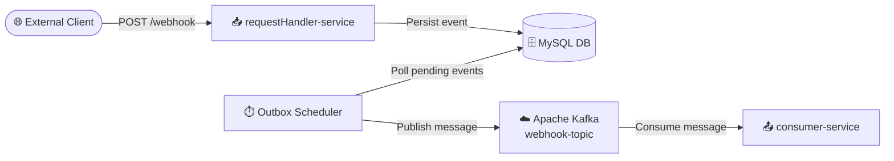
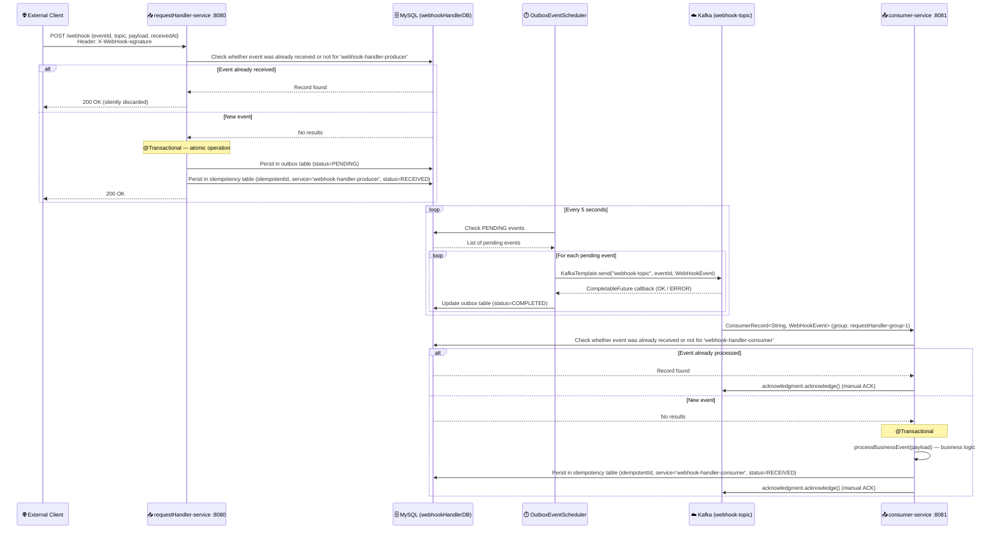
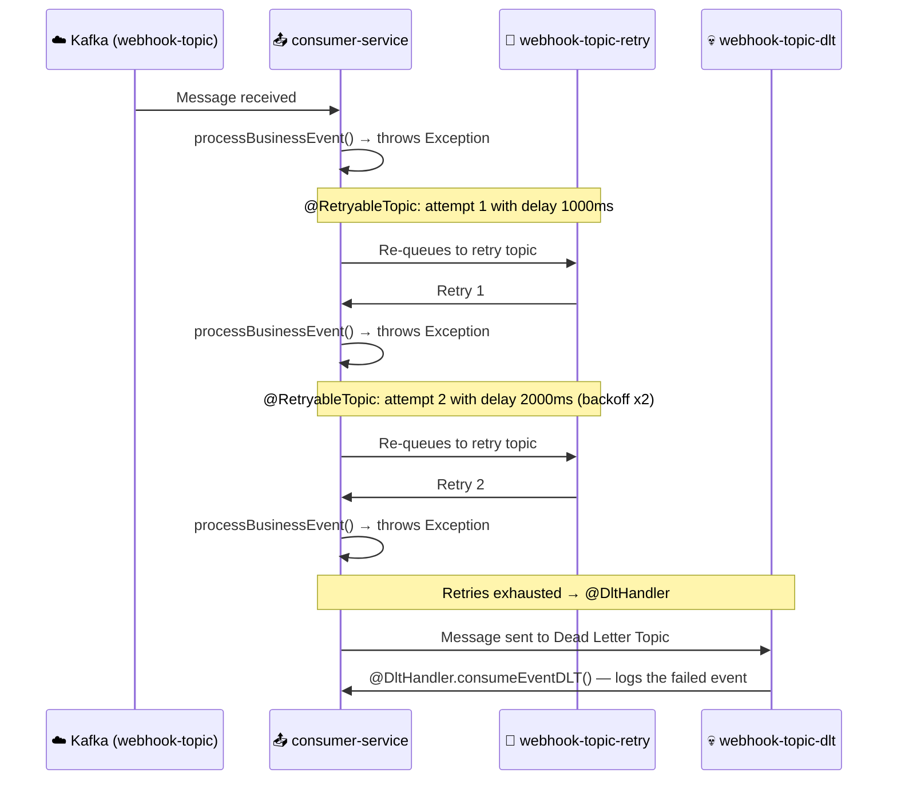

# 📦 Webhook Handler Service

> A reliable webhook reception, processing, and delivery system using the Outbox pattern, idempotency, and asynchronous messaging with Apache Kafka.

## 📋 Table of Contents
- [Overview](#️-overview)
- [Architecture](#️-architecture)
- [Modules & Microservices](#-modules--microservices)
- [Design Patterns](#-design-patterns)
- [Tech Stack](#️-tech-stack)
- [Data Flow](#-data-flow)
- [API Reference](#-api-reference)
- [Getting Started](#-getting-started)

---

## 🏗️ Overview

**Webhook Handler Service** is a microservices system built with **Spring Boot 4** and **Java 25**, designed to securely receive external webhook events and reliably deliver them to internal consumers.

The system addresses the main reliability challenges in webhook reception:

- **Message loss**: via the **Outbox pattern**, events are persisted to the database before being published to Kafka, ensuring no event is lost even if the broker is temporarily unavailable.
- **Duplicate processing**: via the **Idempotency pattern**, both the producer and consumer track already-processed events, preventing duplicates throughout the entire pipeline.
- **Delivery failures**: via **Retry with exponential backoff** and a **Dead Letter Topic (DLT)**, messages that cannot be processed are automatically retried and, if the failure persists, routed to the DLT for analysis.

---

## 🏛️ Architecture

### Architecture Diagram



### Architecture Style

The project follows an **event-driven microservices** architecture with the following characteristics:

- **Maven multi-module**: a parent POM (`webhookHandler-parent`) manages three modules: `common-service`, `requestHandler-service`, and `consumer-service`.
- **Shared Library**: `common-service` acts as a shared library (non-executable), providing JPA idempotency entities, Kafka event models, broker configuration, and serialization utilities.
- **Event-Driven**: inter-service communication is entirely **asynchronous** via Apache Kafka.
- **Shared Database**: both executable services share the same MySQL instance (_Shared Database_ pattern), each managing their own logical tables.


## 🧩 Modules & Microservices

### 1. `common-service` — Shared Library

- **Responsibility**: Library module (non-executable JAR). Contains all reusable components for the other services: domain models, JPA entities, Kafka configuration, serialization, and idempotency pattern logic.


### 2. `requestHandler-service` — Webhook Receiver Service

- **Responsibility**: HTTP entry point for incoming webhooks. Validates event idempotency, persists the event in the Outbox table, and registers its reception. An independent scheduler reads pending Outbox events and publishes them to Kafka.
- **Port**: `8080`


**REST Endpoints:**

| Method | Endpoint | Required Header | Description |
|--------|----------|----------------|-------------|
| `POST` | `/webhook` | `X-WebHook-signature` | Receives an incoming webhook event |
| `GET` | `/outbox` | — | Lists all records in the Outbox table (debug) |
| `GET` | `/idempotent` | — | Lists all idempotency records (debug) |


### 3. `consumer-service` — Event Consumer Service

- **Responsibility**: Consumes messages from the Kafka topic `webhook-topic`, applies idempotency to prevent duplicate processing, executes the business logic for the event, and performs a manual ACK. Handles automatic retries with exponential backoff and routes to the Dead Letter Topic (DLT) on persistent failures.
- **Port**: `8081`


## 🧠 Design Patterns

| Pattern | Description |
|---------|-------------|
| **Outbox Pattern** | The event is atomically persisted in the `OUTBOX_EVENTS` table (status=`PENDING`) within the same HTTP transaction. A scheduler then publishes it to Kafka and marks it as `COMPLETED`. Guarantees _at-least-once delivery_ with no message loss. |
| **Idempotency Pattern** | Before processing any event, both services check whether the `eventId` + `service` combination already exists in `IDEMPOTENT_EVENTS`. If found, the event is discarded. Prevents duplicate processing across the entire pipeline. |
| **Retry + Dead Letter Topic** | Spring Kafka retries processing up to 2 times with exponential backoff. If the failure persists, the message is automatically routed to `webhook-topic-dlt`, where `@DltHandler` logs it. |
| **Circuit Breaker** | Resilience4j dependency included and ready to be applied to downstream calls. Currently prepared for configuration. |
| **Scheduled / Polling** | The scheduler runs every 5 seconds (20s initial delay) to process pending Outbox events, implementing the _polling_ pattern over the outbox table. |


---

## 🛠️ Tech Stack

| Category | Technology | Version |
|----------|-----------|---------|
| Language | Java | 25 |
| Framework | Spring Boot | 4.0.1 |
| Messaging | Apache Kafka | Confluent 7.2.6 |
| Database | MySQL | 8.4 |
| Containers | Docker + Docker Compose | — |

---

## 🔄 Data Flow

### Main Flow: Webhook Reception and Delivery



### Retry Flow and Dead Letter Topic



---

## 📡 API Reference

### Base URLs

| Service | Base URL |
|---------|----------|
| `requestHandler-service` | `http://localhost:8080` |
| `consumer-service` | `http://localhost:8081` |

> ℹ️ A complete Postman collection is available in the `postman/` directory:
> - `postman/WebHook Handler.postman_collection.json`
> - `postman/LOCAL.postman_environment.json`

### `requestHandler-service` — Endpoints

#### `POST /webhook`
Receives an incoming webhook event.

**Headers:**
```
Content-Type: application/json
X-WebHook-signature: <signature>
```

**Request Body:**
```json
{
  "eventId": "evt-uuid-12345",
  "topic": "webhook-topic",
  "payload": "{\"orderId\": \"order-99\", \"amount\": 150.00}",
  "receivedAt": "2026-03-25T10:00:00.000Z"
}
```

**Response:** `200 OK` (empty body). If the event was already received previously (idempotency), also returns `200 OK` without reprocessing.

---

#### `GET /outbox`
Returns all records from the `OUTBOX_EVENTS` table. Useful for debugging and monitoring.

**Response:** `200 OK`
```json
[
  {
    "id": 1000,
    "outboxId": "evt-uuid-12345",
    "payload": "{\"webhookEventId\":\"evt-uuid-12345\", ...}",
    "status": "COMPLETED"
  }
]
```

---

#### `GET /idempotent`
Returns all records from the `IDEMPOTENT_EVENTS` table. Useful for debugging.

**Response:** `200 OK`
```json
[
  {
    "id": 1000,
    "idempotentId": "evt-uuid-12345",
    "service": "webhook-handler-producer",
    "status": "RECEIVED"
  }
]
```

---

## 🚀 Getting Started

### Prerequisites

- **Java 25** (or compatible with the configured toolchain)
- **Maven 3.9+** (or use the included `./mvnw` wrapper)
- **Docker & Docker Compose** (for local infrastructure)

### 1. Clone the repository

```bash
git clone <repo-url>
cd webhook-handler-service
```

### 2. Start the infrastructure (MySQL + Kafka)

```bash
docker-compose up -d
```

This starts:
- **MySQL 8.4** on `localhost:3306` — database `webhookHandlerDB`, user `user`, password `pass`
- **Zookeeper** on `localhost:2181`
- **Kafka Broker** on `localhost:9092`

Verify the containers are running:
```bash
docker-compose ps
```

### 3. Build all modules

```bash
mvnw.cmd clean install
```

> On Linux/Mac: `./mvnw clean install`

### 4. Run the services

**Terminal 1 — requestHandler-service:**
```bash
cd requestHandler-service
..\mvnw.cmd spring-boot:run -Dspring-boot.run.profiles=local
```

**Terminal 2 — consumer-service:**
```bash
cd consumer-service
..\mvnw.cmd spring-boot:run -Dspring-boot.run.profiles=local
```

### 5. Send a test webhook

```bash
curl -X POST http://localhost:8080/webhook \
  -H "Content-Type: application/json" \
  -H "X-WebHook-signature: test-signature" \
  -d "{\"eventId\":\"evt-001\",\"topic\":\"test.event\",\"payload\":\"{}\",\"receivedAt\":\"2026-03-25T10:00:00.000Z\"}"
```

Or import the Postman collection from `postman/WebHook Handler.postman_collection.json` with the environment `postman/LOCAL.postman_environment.json`.

---

